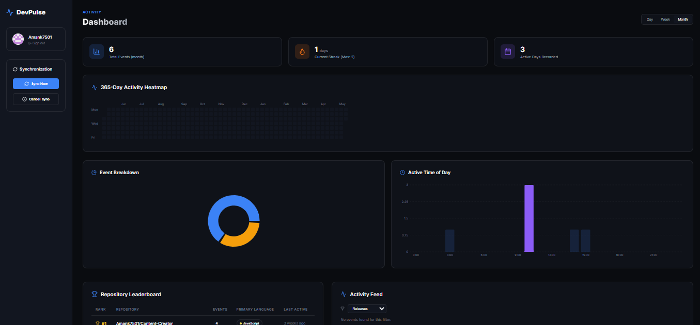

<div align="center">

# DevPulse

### Full-stack GitHub activity analytics dashboard with real-time sync and contribution insights




</div>

---


## Architecture

```
┌──────────────────┐        ┌─────────────────────────────────┐
│   React Client   │ ──────▶│          Express API            │
│  Vite + TS       │ ◀───── │  auth · activity · sync · me   │
│  TanStack Query  │        └────────────┬────────────────────┘
│  WebSocket hook  │                     │
└──────────────────┘        ┌────────────▼────────────────────┐
                            │         PostgreSQL               │
                            │  users · repos · activity_events │
                            └────────────┬────────────────────┘
                            ┌────────────▼────────────────────┐
                            │            Redis                 │
                            │  rate limit · etag · bullmq     │
                            │  pub/sub live:{userId}           │
                            └─────────────────────────────────┘
```

| Layer | Tech |
|---|---|
| Frontend | Vite, React, TypeScript, TanStack Query v5, Recharts |
| Backend | Node.js, Express, TypeScript |
| Database | PostgreSQL, Knex ORM |
| Cache / Queue | Redis, BullMQ |
| Auth | GitHub OAuth 2.0, JWT, AES encryption |
| Real-time | WebSockets, Redis pub/sub |
| DevOps | Docker, docker-compose, nginx |


## Project Structure

```
devpulse/
├── backend/
│   ├── src/
│   │   ├── config/            # env, knexfile, redis
│   │   ├── db/
│   │   │   ├── migrations/    # all knex migrations
│   │   │   └── queries/       # activityQueries
│   │   ├── middleware/        # auth, errorHandler, requestLogger
│   │   ├── routes/            # auth, activity, sync, me, health
│   │   ├── services/          # githubClient, syncService, tokenService
│   │   ├── workers/           # githubSync BullMQ worker
│   │   └── ws/                # wsServer WebSocket
│   └── Dockerfile
├── client/
│   ├── src/
│   │   ├── hooks/             # useActivity, useSync, useMe, useActivitySync
│   │   ├── lib/               # apiClient, queryClient
│   │   ├── pages/             # Dashboard, Login
│   │   └── components/        # RequireAuth
│   └── Dockerfile
├── docker-compose.yml
└── README.md
```


## Features

- 🔐 GitHub OAuth 2.0 with CSRF state validation and AES-encrypted token storage
- 🔄 Real-time sync progress via WebSockets and Redis pub/sub
- 📊 365-day contribution heatmap (owned + collaborator + org repos)
- 📈 Event type breakdown, peak activity hours, and repo leaderboard
- 🔥 Current and longest streak tracking
- ⚡ Per-repo ETag caching to minimize redundant GitHub API calls
- 🐳 Fully containerized with multi-stage Docker builds and nginx reverse proxy


## How It Works

1. **Auth** — User signs in with GitHub OAuth. Access token is AES-encrypted before being stored in the database. A JWT is issued for the session.

2. **Sync** — A BullMQ worker runs every 5 minutes per user. It fetches all accessible repos (owned + collaborator + org) via `/user/repos`, then fetches events per repo using ETags to skip unchanged repos. Only the user's own actions are stored.

3. **Rate limiting** — Before each GitHub API call, remaining rate limit is checked in Redis. If below 100, sync is paused and retried with exponential backoff.

4. **Real-time** — When a sync completes, the worker publishes to a Redis channel. The WebSocket server forwards progress messages to the connected client. React Query invalidates and re-fetches automatically.

5. **Analytics** — All visualizations (heatmap, streaks, peak hours, leaderboard) are derived client-side from the activity data returned by the API.
